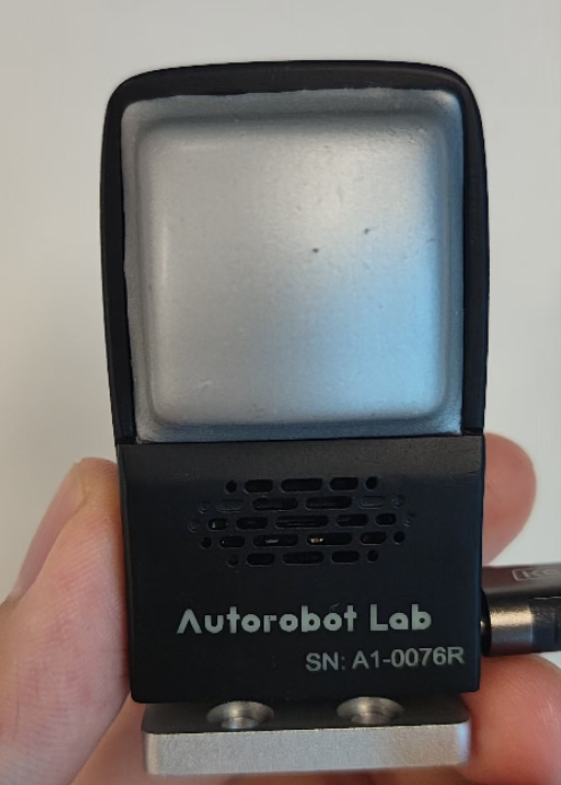
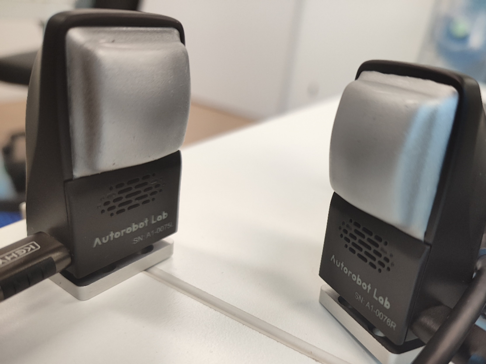

# Tac3D_ros
Ros1 message support for tactile sensor Tac3D:<https://arxiv.org/abs/2202.06211>
## Compile
```bash
catkin_make
```
## Send messages
Topic: tactile_frame
<br>Single tactile sensor:

<p align="center">
  
</p>

<br>Message: Frame.msg
<br>string SN
<br>uint32 index
<br>float64 sendTimestamp
<br>float64 recvTimestamp
<br>float64[1200] Positions   #flatten
<br>float64[1200] Displacements  #flatten
<br>float64[1200] Forces         #flatten
<br>float64[3] ResultantForce
<br>float64[3] ResultantMoment

```python
python3 Tac3D_ros/src/tactile_msgs/src/PyTac3D_ros.py
```

<br>Double tactile sensor:
<p align="center">
  
</p>

<br>Message: TactileMsg.msg
<br>std_msgs/Header header
<br>Frame left
<br>Frame right

```python
python3 Tac3D_ros/src/tactile_msgs/src/PyTac3D_double_ros.py
```
